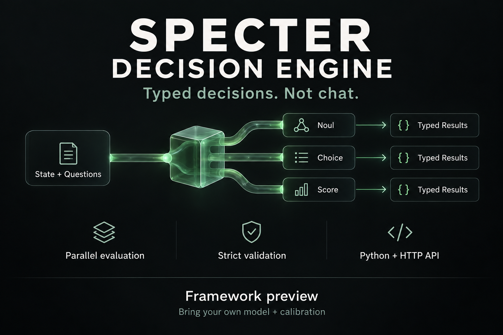

# Specter Decision Engine

Project author: **Guilherme Peralta Novaes**. Developed with AI assistance.

Pricing policy: no Specter framework fee. Model providers, compute and hosting may cost money; no model or validated calibration is bundled. Usage and redistribution terms remain pending in `LICENSE_NOTICE.md`. No-fee pricing is not an open-source license.

**Typed decisions. Not chat.** A Python framework for bounded, independent decision evaluation inside software and agents.



**Status: 0.2.0rc2 — framework preview. No trained model or validated calibration is included. License pending; this is not currently an open-source-licensed release.**

## Install

Python 3.11+ is required. No GPU and no third-party runtime dependencies are required for the framework; your model adapter may have its own requirements.

Once the GitHub prerelease is published, install its wheel directly (no Git required):

```sh
python -m pip install https://github.com/gamerbooker/specter-decision-engine/releases/download/v0.2.0rc2/specter_decision_engine-0.2.0rc2-py3-none-any.whl
python -m specter_decision doctor
```

Use `py` on Windows or `python3` on macOS/Linux if that is your Python command. Prefer a virtual environment:

| Terminal | Create environment | Install a downloaded wheel |
|---|---|---|
| PowerShell / cmd | `py -m venv .venv` | `.venv\Scripts\python -m pip install specter_decision_engine-0.2.0rc2-py3-none-any.whl` |
| Bash / zsh | `python3 -m venv .venv` | `.venv/bin/python -m pip install specter_decision_engine-0.2.0rc2-py3-none-any.whl` |

An activated environment also exposes `specter-decision doctor`. If the command is not on PATH, use `python -m specter_decision doctor`. A successful doctor check verifies installation, **not model readiness**. This project has not been uploaded to PyPI; do not assume the bare package name resolves to this project.

Offline installation: download the wheel and SHA256SUMS, verify the checksum, then `python -m pip install --no-index ./specter_decision_engine-0.2.0rc2-py3-none-any.whl`.

## What it does

| Question | Decision value | Distribution |
|---|---|---|
| Noul | Probability of yes, 0–1 | `[P(no), P(yes)]` |
| Choice | One supplied option | One probability per option |
| Score | Continuous expected level | One probability per ordered rubric level |

Every successful decision includes `value`, `probabilities`, `confidence`, and `legend`. Failed decisions have typed error codes and null numeric fields, never fabricated answers.

```text
state + typed questions
        ↓ immutable snapshot
independent bounded async evaluations
        ↓ numeric model logits
versioned calibration → typed decisions
```

Questions do not see sibling questions or answers. IDs route results and are not passed to the model. The default projector uses argmax for Choice and a weighted mean for Score. Async concurrency is not a claim of custom GPU-parallel inference.

## Python integration

```python
from specter_decision import Question, SpecterDecisionEngine

engine = SpecterDecisionEngine(
    backend=my_numeric_backend,
    calibration=my_validated_calibration,
    domain="support-v1", concurrency=8, timeout=2.0,
)
answers = await engine.decide(
    {"ticket": "Export fails in Safari but works in Chrome."},
    [
        Question("workaround", "noul", "Is a workaround available?"),
        Question("team", "choice", "Which team should review?",
                 ("billing", "engineering", "support")),
        Question("severity", "score", "How severe is the issue?",
                 ("cosmetic", "degraded with workaround", "blocked without workaround")),
    ],
)
```

`my_numeric_backend` and `my_validated_calibration` are application-provided implementations, not hidden bundled models. `Backend.logits(state_json, question)` is async and returns finite numbers. `Calibration` supplies a compatibility check, temperature and an independently validated confidence map. Adapters must honor cancellation and isolation.

No compatible calibration → `UNCALIBRATED`, without calling the backend. Calibration quality must be demonstrated on held-out domain data; the framework cannot certify a user-supplied artifact. Confidence must refer to a specified event: correct class for Noul/Choice, or score error within the configured tolerance for Score.

## HTTP / other languages

Use the [OpenAPI 3.1 contract](specter_decision/openapi.json) to generate clients or integrate with your agent tooling:

- `POST /v1/decision/evaluate`
- `GET /v1/decision/capabilities`
- `GET /v1/decision/openapi.json`

All require Bearer authentication. There is no hosted inference endpoint in this release. The HTTP adapter is intended for integration into an existing application, not as an internet-facing standalone production server.

Python client:

```python
import os
from specter_decision import Question
from specter_decision.client import DecisionClient

client = DecisionClient("http://127.0.0.1:8888", os.environ["SPECTER_DECISION_TOKEN"])
result = client.decide("Export failed", [Question("blocked", "noul", "Is work blocked?")], domain="support-v1")
```

CLI request file format: `{"state":"Export failed","domain":"support-v1","questions":[{"id":"blocked","type":"noul","instructions":"Is work blocked?"}]}`.
After configuring the endpoint and putting its token in `SPECTER_DECISION_TOKEN`:

```sh
# Bash / zsh / cmd
python -m specter_decision evaluate --url http://127.0.0.1:8888 < request.json
```

```powershell
# PowerShell (ASCII JSON, or configure the pipeline's UTF-8 encoding)
Get-Content -Raw request.json | python -m specter_decision evaluate --url http://127.0.0.1:8888
```

Remote endpoints require HTTPS. Tokens are not accepted as CLI arguments. No automatic retries, redirects, command execution, autonomous recruitment, or external provider calls are bundled.

## Limits and reliability

- Up to 128 questions, 255 Choice options, 10 Score levels and a 256 KiB request.
- Bounded concurrency, deadlines, finite-number validation, ordered outputs and explicit failures.
- Duplicate JSON keys and non-finite JSON numbers are rejected.
- Type/schema constraints reduce format errors; they do not guarantee correct judgments.
- A blocking or cancellation-resistant backend needs process isolation outside this kernel.
- `production_ready` remains false in this preview. No accuracy, calibration, latency or cost benchmark is claimed for a real model.

## Development

```sh
python -m pip install ".[test]"
python -m unittest -v
```

Two optional tests for a locally installed Specter-Core are skipped by default. They require an explicit `SPECTER_TEST_LOCAL_CORE=1` on a machine with that installation; the portable suite does not require it. Fixtures are synthetic and must never be deployed as a model/calibrator.

The source is designed for Python 3.11+ across Windows, macOS and Linux. Local verification was performed on Windows; other operating systems are not yet verified. Please report your OS, Python version and a minimal non-sensitive reproducer.

## Roadmap / feedback

Next: a real numeric adapter, domain dataset, held-out calibration, load testing, third-party review and a license decision. Feedback is welcome on the contract, error handling and adapter boundary. Please do not attach credentials, private prompts or personal data to issues.

Inspired by [typed decision interfaces](https://docs.typesafe.ai/introduction), independently implemented and not affiliated with TypeSafe. This is not Jev's model, weights, RLCD implementation or a demonstrated performance replica.

## License

The owner has not selected a license. Public visibility and installation instructions do not constitute an open-source license or a blanket grant to reuse or redistribute this code. See [LICENSE_NOTICE.md](LICENSE_NOTICE.md).
